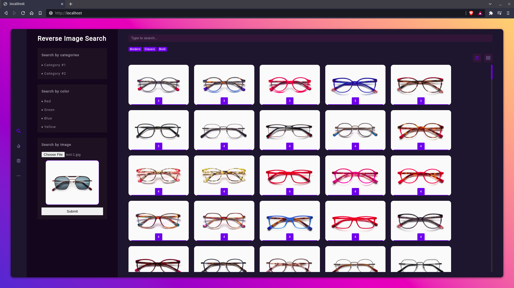

# Perceptual Hashes (pHashes)

> Demostración sobre cómo construir un Reverse Image Search basado en p-Hashes y PHP


[TOC]

## Qué son los Perceptual Hashes

Para obtener más información sobre los Perceptual Hashes, también llamados p-Hashes, puede consultar la entrada [Introducción A Los Hashes Perceptivos: Medición De La Similitud](https://apiumhub.com/es/tech-blog-barcelona/introduccion-hashes-perceptivos-medicion-de-la-similitud/) de nuestro blog que trata precisamente de este tema.

## Sobre esta aplicación

Esta aplicación es una prueba de concepto que demuestra cómo aplicar p-Hashes para mejorar los procesos de búsqueda de un ecommerce.

> Por tanto, esta aplicación debe ser considerada una demostración a título educativo y nunca debería usarse en entornos de producción.

### Caso de Uso

Imaginemos el supuesto en el que un usuario quiere comprar unas gafas porque las que actualmente usa están rotas o deterioradas. Debido al paso del tiempo, ni la marca, ni el modelo ni el código de referencia son legibles por lo que al usuario no le quedan más opciones que pasarse horas y horas realizando búsquedas en diferentes plataformas buscando un modelo similar y puede que termine sin encontrar el modelo deseado.

Para cualquier ecommerce esta situación supone un impacto en términos de consumo de recursos ya que implica un número elevado de peticiones y, en el peor caso, paginar prácticamente todo su catálogo, sin apenas conversión.

#### Propuesta

Para mejorar la experiencia de usuario se desarrollará un Reverse Image Search basado en p-Hashes.

#### Expectativas

Con esta funcionalidad el buscador del ecommerce podrá, además de las funciones básicas, mostrar el catálogo de productos ordenados por similitud a un producto determinado.

Así pues, en el supuesto actual, el usuario sacaría una foto de las gafas actuales y la enviaría al servidor. Éste calculará el Hash de dicha imágen y lo comparará con el asignado a todas las imágenes del catálogo, pudiendo así definir un grado de similitud a partir del cual excluir aquellos productos que sean totalmente diferentes o bien, que por cuestiones de negocio, excluir aquellos que no sean relevantes para el usuario.

De este modo, en el mejor de los casos, el usuario podrá encontrar las gafas que desea en la primera página de resultados o bien, en su defecto, aquellos modelos más parecidos al buscado sin necesidad de paginar, mejorando así la experiencia de usuario.

Desde el punto de vista del ecommerce esta propuesta reduce el número de peticiones al servidor y aumenta el grado de conversión al mostrar en la primera página de resultados todos los productos que son similares al buscado.

### Mockup

Para poder mostrar este caso de uso se ha creado un pequeño componente reactivo en Vue que permita hacer las búsquedas y mostrar el resultado de una manera dinámica:




## Construído con

* [Docker](https://www.docker.com/) - La manera más rápida de crear aplicaciones en contenedores.
* [nginx](https://www.nginx.com/) - Servidor web, balanceador de carga avanzado y reverse proxy todo en uno.
* [PHP-FPM](https://www.php.net/) - Lenguaje de programación generalista que está especialmente diseñado para el desarrollo web.
* [ImageMagick](https://imagemagick.org/) - Software que permite manipular imágenes desde el lado del servidor.
* [VueJS](https://vuejs.org/) - Un framework JavaScript progresivo.
* Make - Utilidad make GNU para mantener grupos de programas.

## Requisitos

- Docker
- Git

## Consideraciones

Para simplificar la puesta en marcha la aplicación responde por defecto a la URL `http://localhost`

## Instalación

Para instalar esta aplicación basta con clonar el proyecto en local:

```bash
$ cd ~ && mkdir -p demos/perceptual-hashes
~demos/perceptual-hashes$ git clone https://github.com/apiumhub/demo-perceptual-hashes
```

## Uso

La aplicación cuenta con un Makefile que contiene todos los comandos útiles para su puesta en marcha:

### Comandos disponibles

```bash
~demos/perceptual-hashes$ make
```

### Construcción del servicio

```bash
~demos/perceptual-hashes$ make build
```

### Iniciando el servicio

```bash
~demos/perceptual-hashes$ make up
```

> Ahora ya puedes acceder al servicio usando tu navegador favorito desde la URL`http://localhost`

### Parando el servicio

```bash
~demos/perceptual-hashes$ make down
```
